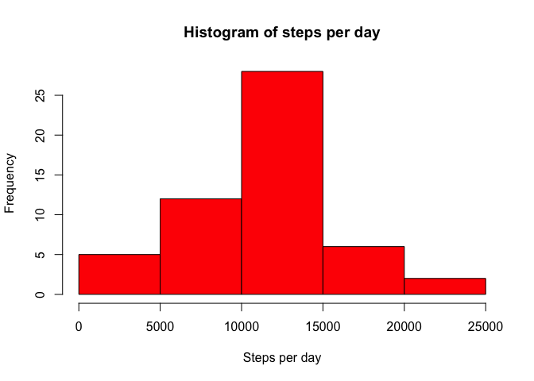
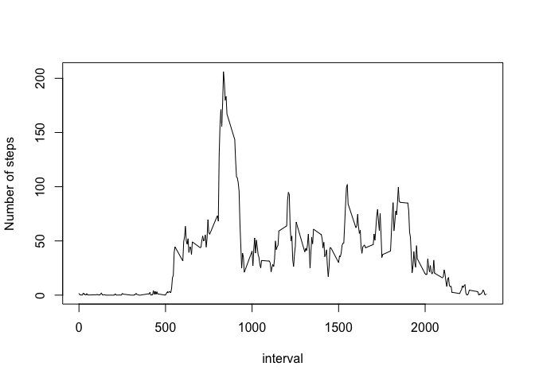
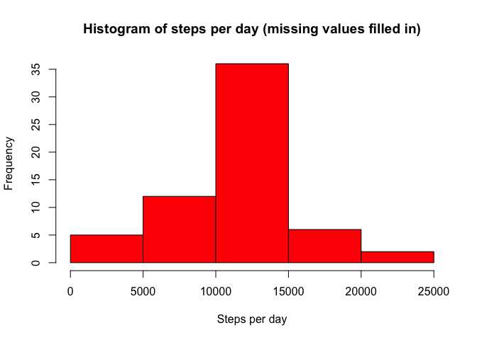
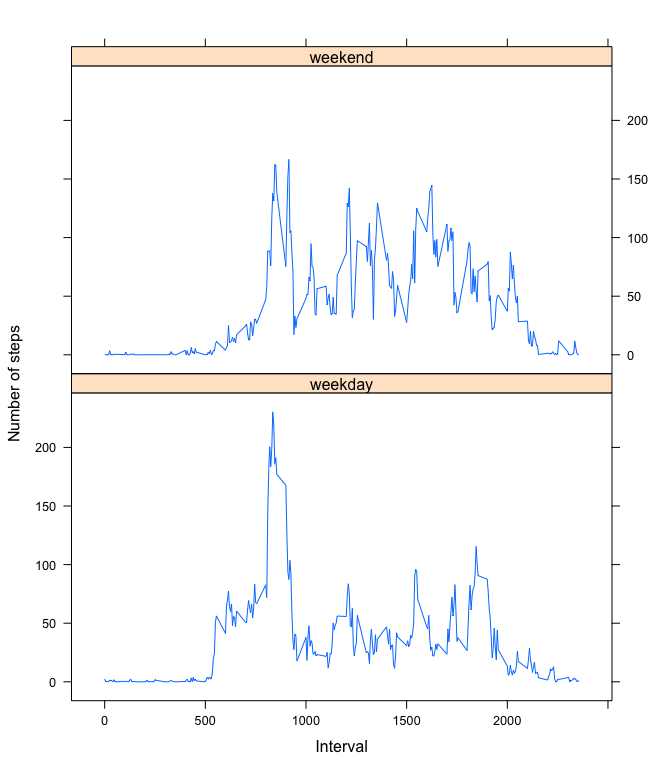

# Reproducible Research: Peer Assessment 1
Søren Lind Kristiansen

## Notes
Before we begin, we need to do a bit of setting up. First, when manipulating the data, we will use the package `dplyr` so we have to load that by calling `library(dplyr)`. Secondly, when pushing to GitHub, we need our figure files stored in a folder called `figure`
so we might as well make our code store them there for us. We can make that happen by using `opts_chunk` which in turn requires loading the `knitr` library explicitly. Finally we load `lattice` to be able to use `xyplot`. Here's how it's done:

```r
suppressMessages(library(dplyr))
suppressMessages(library(knitr))
opts_chunk$set(fig.path = "./figure/")
library(lattice)
```
(In case you wonder why the `library` calls are put inside a call to `supressMessage`, it's just to avoid having the output that is generated when loading the packages show up in this document. Alternatively, we could achieve this by specifying `{r echo=FALSE}` but the project instructions specifcally state that all code blocks should begin with `{r echo=TRUE}`.)

## Loading and preprocessing the data
The first task of the project is to load the data. We load it into a data frame called `activity`. It's easily done as shown below. For good measure, we print the dimensions of the data frame. This tells us how many rows and columns the data frame contains.

```r
activity <- read.csv(unz("activity.zip", filename = "activity.csv"))
dim(activity)
```

```
## [1] 17568     3
```

## What is the total number of steps taken per day?
### Calculating total number of steps per day
Our next task is to calculate the total number of steps per day. We can do this by grouping the data by day and then calculate the sum for each group. This is fairly simple when using `dplyr`:

```r
library(dplyr)
grouped <- activity %>%
  filter(!is.na(steps)) %>%
  group_by(date) %>%
  summarise(steps=sum(steps)) %>%
  arrange(date)
stepsPerDay <- grouped$steps
```

### Histogram of the daily totals
Now that we have the total number of days for each day stored in the `stepsPerDay` variable, we can easily plot a histogram:

```r
hist(stepsPerDay,
     col = "red",
     breaks = 5,
     main = "Histogram of steps per day",
     xlab = "Steps per day")
```

 

### Mean of daily totals
Our next task is to calculate the mean of the daily totals. This can be done using the `mean` function:

```r
averageStepsPerDay <- mean(stepsPerDay)
averageStepsPerDay
```

```
## [1] 10766.19
```

### Median of daily totals
The median can be calculated in a similar way using the `median` function:

```r
median <- median(stepsPerDay)
median
```

```
## [1] 10765
```


## What is the average daily activity pattern?
### Calculating the daily pattern
Since we have data in 5-minute intervals for several days, it makes sense to calculte the daily activity pattern. This is our next task. For each 5-minute interval, we will calculate the average over all the days. Again `dplyr` comes to our rescue: we can easily group the data by 5-minute interval and then calculate the average step count for each group:


```r
library(dplyr)
intervalMeans <- activity %>%
  filter(!is.na(steps)) %>%
  group_by(interval) %>%
  summarise(stepsmean=mean(steps)) %>%
  arrange(interval)
```

### Plotting the daily pattern
Using the base plotting system we can plot the activity pattern like so:

```r
plot(intervalMeans, type = "l", ylab = "Number of steps")
```

 

### 5-minute interval with the maximum number of steps
We must now find out which 5-minute interval, on average across all the days in the dataset, contains the maximum number of steps:

```r
maxStepsIndex <- which.max(intervalMeans$stepsmean)
maxSteps <- intervalMeans$stepsmean[maxStepsIndex]
maxStepsInterval <- intervalMeans$interval[maxStepsIndex]
maxSteps
```

```
## [1] 206.1698
```

```r
maxStepsInterval
```

```
## [1] 835
```

As shown above, maximum number of steps is 206.2 which is found in interval number 835.

## Imputing missing values
### Counting the missing values
Our next task is to calculate and report the total number of missing values in the dataset (i.e. the total number of rows with NAs). The rows with NAs are not considered 'complete' by R, so we can use the `complete.cases` function. We then simply count the rows that are not complete. Note that we can use the `sum` function for counting because `FALSE` counts as 0 and `TRUE` counts as 1.

```r
sum(complete.cases(activity) == FALSE)
```

```
## [1] 2304
```

### Replacing missing values with 5-minute interval means
We need to impute missing values. A simple but sufficient strategy is to just use the mean for that 5-minute interval. We already have the interval means stored in `intervalMeans`. So, all we need to do is use those to fill in the missing values.

First we will merge the interva means onto the original data, creating a new data frame:

```r
activityImputed <- merge(activity, intervalMeans, by = "interval")
```

Now, the `activityImputed` data frame has an extra column, `stepsmean`. All we have to do is to copy the value of that column to the `steps` column whenever the `steps` column is `NA`. This is easily done using `transform`:


```r
activityImputed <- transform(activityImputed, steps = ifelse(is.na(steps), stepsmean, steps))
```

### Grouping the data
Our next main task is to plot another histogram of daily totals using our new dataset in which we have imputed the misssing values. First we need to calculate the daily totals. This is done using `dplyr` as before:

```r
groupedImputed <- activityImputed %>%
  filter(!is.na(steps)) %>%
  group_by(date) %>%
  summarise(steps=sum(steps)) %>%
  arrange(date)
stepsPerDayImputed <- groupedImputed$steps
```

### Plotting the histogram
Finally we are ready to plot the histogram using the daily totals we stored in the `stepsPerDayImputed` in the previous step:

```r
hist(stepsPerDayImputed,
     col = "red",
     breaks = 5,
     main = "Histogram of steps per day (missing values filled in)",
     xlab = "Steps per day")
```

 

### Comparing mean and median
Our task is now to calculate the mean and median on the data with the filled in values and compare them to the mean and median of the original data.

```r
averageStepsPerDayImputed <- mean(stepsPerDayImputed)
paste("Change in average: ", averageStepsPerDayImputed - averageStepsPerDay)
```

```
## [1] "Change in average:  0"
```

And the median:

```r
medianImputed <- median(stepsPerDayImputed)
paste("Change in median: ", medianImputed - median)
```

```
## [1] "Change in median:  1.1886792452824"
```

## Are there differences in activity patterns between weekdays and weekends?
We must now compare activity patterns between weekdays and weekends. We will break this step up in a couple of subtasks.

### Finding weekends
First, we need to be identify which dates are weekdays and which are weekends. We can convert the date strings in our data to `POSIXlt` values which let us know the day of the week as an integer between 0 and 6 where 0 is sunday. Using this, we can create a function called `dayType` which for a given date string returns either "weekend" or "weekday":


```r
dayType <- function(dateString) {
  wday <- as.POSIXlt(dateString)$wday
  if (wday %in% c(0,6)) {
    "weekend"
  } else {
    "weekday"
  }
}
```

Now, using our new function, we can add the type of day (weekend or weekday) to our (imputed) dataset:


```r
activityImputed$dayType <- as.factor(sapply(activityImputed$date, FUN=dayType))
```

### Filtering, grouping and calculating means
Now all we need to is group the data by our new `dayType` variable as well as the  5-minute interval and then calculate the means -- all using `dplyr`:

```r
intervalMeansImputed <- activityImputed %>%
  group_by(interval, dayType) %>%
  summarise(steps=mean(steps)) %>%
  arrange(interval)
```

### Panel plot
Finally we can make our panel plot:

```r
xyplot(
  steps~interval|dayType,
  intervalMeansImputed,
  type = "l",
  layout = c(1, 2),
  xlab = "Interval",
  ylab = "Number of steps")
```

 

As the plot shows, there tends to be a bit more activity during the early morning on the weekdays compared to the weekends. In the weekends, on the other hand, there is a bit more activity during the day.
